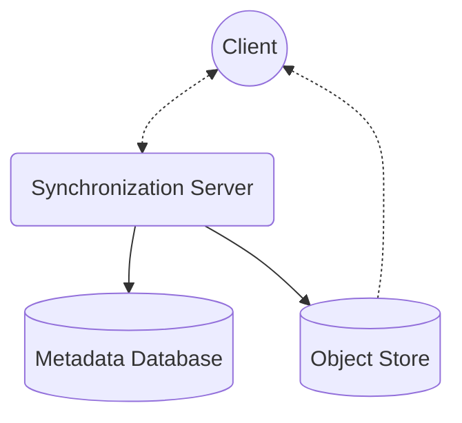

# safesync
## Introduction

This is an end-to-end encrypted file syncing application
with the client written in Python and the backend Haskell inspired by cloud hosting services such as Dropbox and Mega. A considerable emphasis has been placed on data integrity, privacy, and security.

Website: [https://safesync.reyn.dev](https://safesync.reyn.dev)

### Table of Contents

[Client Side Application](client/README.md)

[Backend Application](backend/README.md)

**Libraries and tools used**:

- `PostgreSQL` as the backend database
- `MinIO` as the file object store
- `Scotty` - A Haskell library for the backend web framework.
- `esqueleto/persistent` for backend database management.
- `crypto` for client side encryption.
- `requests` for client side HTTPs.
- `watchdog` for file management.

# Architecture Overview

The general architecture is composed of a client side application, an backend server, a backend database, and an object store. The notification server is used to ping the client with upload information to help maintain consensus. The synchronization server points to and encryption keys as well as the file object store. The file syncing and storage process is based around protocols such as rsync, Dropbox’s [Streaming Sync](https://dropbox.tech/infrastructure/streaming-file-synchronization),  and mega.io, with encryption done client side using symmetric encrypting.

Code for the client side application is written in Python and the backend is written in Haskell. The backend database use PostgreSQL as a database management system and [MinIO](https://min.io/) is used as an object store for storing files.

# Security Overview

One of the most effective ways to ensure security and privacy in a cloud storage environment is through client side encryption. Client side encryption ensures that without the encryption keys, data can’t be read on the backend. Furthermore, MinIO supports an additional layer of server side encryption. This is similar to cryptographic splitting, as files are first partitioned and then encrypted on both the client and server side. This means that both the client and server need to work in coordination for file decryption.

AES-GCM is used for encryption with randomly generated 128 bit symmetric keys. AES-GCM is used because AES in general is an industry standard in symmetric key cryptography, and Galois Counter Mode (GCM) is good for maintaining data integrity and confidentially. AES-GCM is also relatively portable and wont be severely limited by the users hardware.

## Initial Authentication

Users are authenticated password-less.

- Password-less authentication can be done using  third party sign-in (such as Google), or another service, TOTP, one time passcodes, a physical security key, email, SMS, biometric, etc. This can also include multi-factor authentication (MFA).
- This is done because the master key is encrypted with the users password, and this would prevent the ability to derive the master key server side.

Generally, I’d want to require some for of MFA, with recommended use of third party sign-in, security keys, and/or TOTP.

## **Master Key Derivation**

After authentication, a master key is derived. The master key is used to decrypt stored file encryption metadata and symmetric keys, which is what’s later used for file encryption and decryption.

A password is used for the purpose of key derivation. A 128 bit master key salt is stored server side as well as a SHA256 hash of the master key.

1. The master key is derived using the users password and Argon2i.
    - Argon2 is a memory intensive key derivation function. Salt length, key length, number of threads, iterations, and memory usage can all be increased to increase security.
2. The master key is hashed and sent server side for key authentication. This needs to match before files are sent to the client.
    - A brute force attack would need to continuously derive keys for each given salt, as well as a matching SHA256 hash of the derived key, rendering this significantly harder to brute force than using a salted password hash for authentication.
3. Afterwards, the partition metadata and symmetric keys can be sent to the client and decrypted.

## Client Side Encryption

1. For regular files, each partition is encrypted with a randomly generated 128 bit symmetric key using AES-GCM.
    - Metadata and partition information is encrypted with the same key.
    - The partition key is encrypted with the master key.
    - For directories, only the metadata is encrypted.
2. A post request for each partition is sent to the storage server, first with information about which partitions need to be updated.
    - Requests can be sent asynchronously as the rest of the file is being encrypted.
    - This also includes information about which partitions need to updated as well as encrypted metadata to allow.

This means that even if the case of the backend object store is leaked, every partition is encrypted with a separate key. The only way data can be compromised is if the users master key is compromised, the server side keys are compromised, the server file journal containing the keys and partition information is exposed and decrypted, and the backend object store is expose

## Server Side Encryption

MinIO, the object store I am using, allows for an additional layer of server side encryption. This is going to be used to offer an additional layer of protection.
