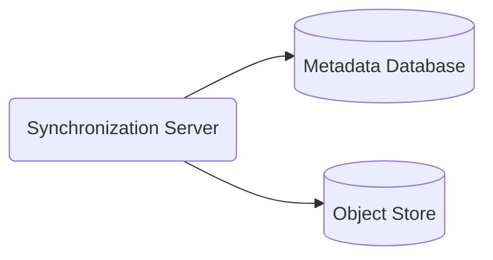
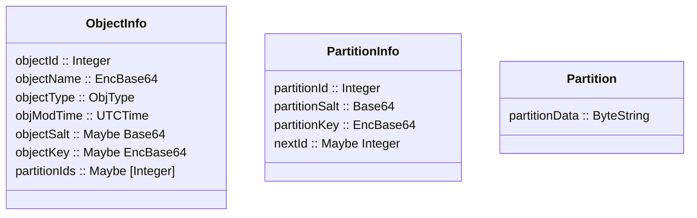

# Backend Application

## Synchronization and Backend Storage

The backend consists of a synchronization server, a metadata database for storing partition and file information, and an object store used for storing files.



## Object Storage

For file storage, I am going to use MinIO as an object store. An object store treats files as objects and stores them in bucket in a non-hierarchical manner. In our case, file partitions will only be created, overwritten, and deleted, rather than being modified in place.

The object store is organized into two buckets with each bucket containing per-user subfolders.

- A staging bucket used for storing partitions during the upload process. This is done to prevent corruption and partition mismatch in case of broken connections.
- A partitions bucket used for fully synced partitions.

### Reasons for using MinIO

Object stores are commonly used in cloud storage because it allows for fast reads and writes, is more horizontally scalable, and makes maintaining consensus between distributed storage relatively easy. Object stores are typically paired with another database for storing metadata.

Some of the most popular cloud based object storage options include Amazon S3, Google Cloud Storage, and Microsoft Azure Blob Storage. With Amazon [being the leader in the cloud service industry](https://www.srgresearch.com/articles/as-quarterly-cloud-spending-jumps-to-over-50b-microsoft-looms-larger-in-amazons-rear-mirror), an S3 compatible storage option is a good idea because it would allow for compatibility with a plethora of different libraries, frameworks, and other tools and would also making switching services down the road much easier, if necessary.

Given that our goal is to maintain both privacy and security, I’ve decided to use the S3 compatible but self-hosted object store MinIO on my own private servers. This removes the reliance on third parties and is also more cost effective for small scale project. MinIO also has a relatively easy to use Haskell library making it a good choice for this project.

## Synchronization

The upload processes can be broken down into an initialization phase, a synchronization phase, and a confirmation phase.

1. **Initialization:** a POST request containing upload info is sent, with the number of partitions, last partition size, and expected partition ids.
2. **Synchronization:** each encrypted partition is uploaded with its own HTTPs POST request, containing the synchronization token. The partitions are stored in the staging bucket in the object store in a subfolder.
3. **Confirmation:** this includes validating the hashes of each partition, the size of the last partition, and the total number of partitions. After each partition is uploaded, the partitions are moved from the staging bucket to the storage bucket.



## Database

The metadata database is PostgreSQL used for storing partition info, symmetric keys, metadata, and access information. This is done using three tables, an access list table, an objects table, and a partitions table.

The **partitions table** is used to store partition encryption information, partition order information, and a pointer to its location on the file object store.

| Field | Type | Notes |
| --- | --- | --- |
| partitionId | int | Primary Key |
| objectStoreId | string | Points to its object store location |
| salt | bytes |  |
| *key | bytes | 128 bit AES-GCM symmetric key |
| next | bytes? | Recursive foreign Key |

Fields marked with an asterisk are encrypted client side with the symmetric key. The symmetric key itself is with the parent objects encryption key.

The **object table** contains an encryption key and salt, encrypted file metadata, such as the path and modification time, as well as the head of the object in the partitions table.

| Field | Type | Notes |
| --- | --- | --- |
| objectId | int | Primary Key |
| type |  | Directory/File |
| salt | bytes |  |
| *name | bytes |  |
| *modTime | bytes | UTC timestamp |
| *key | bytes |  |
| head | int | partitionId |

The **access list table** is a linking table between users and and partition information. The updated field is also used for synchronization.

| Field | Type | Notes |
| --- | --- | --- |
| userId | int | Pk/Fk |
| objectId | int | Pk/Fk  |
| status | status | either active/deleted |
| updated | timestamp | UTC timestamp |

Postgres is a good choice for a database because its cross platform, free, and open source. Postgres has also grown considerably over the years and is well known for its reliability and scalability. Postgres is also compatible with Amazon Aurora, which aligns with our choice of MinIO which was partially chosen for Amazon S3 compatibility.

## Synchronization API

The backend utilizes a private REST api called by the client application for managing files and partitions. The synchronization api is defined is with the following endpoints:

| Endpoint | Methods |
| --- | --- |
| /object | GET |
| /partition  | GET, POST |

## Endpoint Usages

**`/object`** - **GET**

This is first queried to get a list of partition ids and object information for updating the client.

```json
{
	"objectId": "<objectId>",
	"objectName": "<base64 encrypted name>",
  "objectType": "file",
  "objectModTime": "<object file modification time>",
	"objectSalt": "<base64 key objectSalt>",
  "objectKey": "<base64 encrypted symmetric key>",
  "partitionKey": "<base64 encrypted symmetric key>",
  "nextId": "next partition id>",
	"partitionIds": []
}
```

**`/partition/<partitionId>`** - **POST**, Upload a partition

**`/partition/<partitionId>`** - **GET**, Download a partition

**`/partition/<partitionId>/info`** - **GET**

After `/object` is queried, the partition information and partition data itself are downloaded asynchronously.

```json
{
	"partitionId": "<partitionId>",
	"partitionSalt": "<base 64 salt",
  "partitionKey": "<base64 encrypted symmetric key>",
   "nextId": "next partition id>"
}
```
